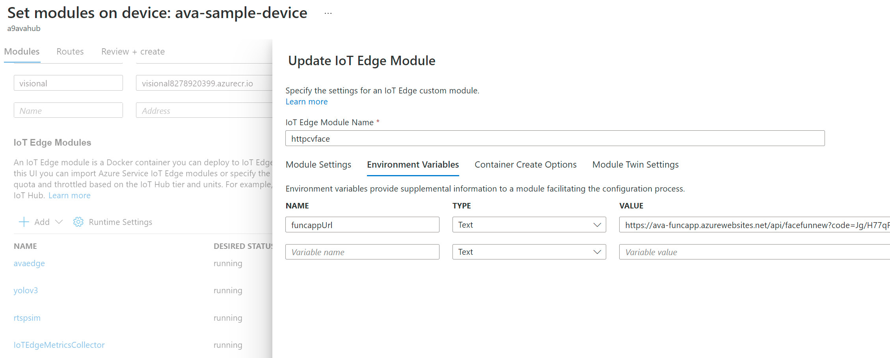
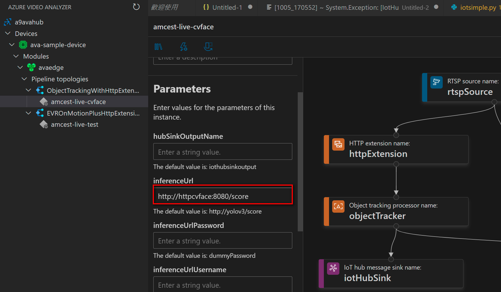

# Http Extension module for No face frame filter 

The HTTP extension module enables your own IoT Edge module to accept video frames as an http POST request.

## Prerequisites

1. [Install Docker](https://docs.docker.com/desktop/#download-and-install) on your machine
1. [Install IoT Edge Runtime](https://docs.microsoft.com/en-us/azure/iot-edge/how-to-install-iot-edge?tabs=linux)

### Design

This http extension server is a Python terminal application that will house your custom AI and is built to handle http requests. The server reads the video frame, processes it using an Image Processor, and returns inference results as a json response.

*main.py*: this is the entry point of the application. It is responsible for the configuring and management of the http extension server.


```
Main()
```
In this method we:
1. Create an instance of http extension server.
2. Create an instance of the image processor.
3. Define a route for handling the client requests.
4. Set the address and port the http extension server will listen on for client requests.

*imageProcessor.py*: this class is responsible for processing the image. In a nutshell, it reads the raw bytes, converts an image to grayscale and determines if its color intensity is dark or light. You can add your own processor logic by adding a new class and implementing the method:

```
ProcessImages(self, imgBytes):
```
Once you've added the new class, you'll have to update the InferenceServer so it instantiates your class and invokes the **ProcessImage** method on it to run your processing logic.

### Building, publishing and running the Docker container

To build the image, use the Docker file named `Dockerfile`.

First, a couple assumptions

* We'll be using Azure Container Registry (ACR) to publish our image before distributing it
* Our local Docker container image is already logged into ACR.
* In this sample, our ACR name is "myregistry". Your name may defer, so please update it properly in the following commands.

> If you're unfamiliar with ACR or have any questions, please follow this [demo on building and pushing an image into ACR](https://docs.microsoft.com/en-us/azure/container-registry/container-registry-get-started-docker-cli).

`cd` onto the http extension's root directory 

```
sudo docker build -f ./docker/Dockerfile -t httpcvextension:latest .

sudo docker tag httpcvextension:latest myregistry.azurecr.io/httpcvextension:latest

sudo docker push myregistry.azurecr.io/httpextension:latest
```


## Using the http extension container

Test the container using the following commands

### /score

To get the response of the processed image, use the following command

## Docker run image to boot up testing container :
sudo docker run -d -p 5001:8080 --name httpextension httpcvextension:latest
curl -X POST http://localhost:5001/score -H "Content-Type: image/jpeg" --data-binary @test.jpg

```bash
curl -X POST https://<REPLACE-WITH-IP-OR-CONTAINER-NAME>/score -H "Content-Type: image/jpeg" --data-binary @<image_file_in_jpeg>
```

If image has faces inside, you will see JSON printed on your screen that looks something like this

```JSON
{"inferences": [{"type": "entity", "entity": {"tag": {"value": "TommyNoMask", "confidence": 0.91908}, "box": {"l": 0.44711538461538464, "t": 0.4543269230769231, "w": 0.14903846153846154, "h": 0.14903846153846154}}}]}
```
if no faces, then reutrn nothing like ""

## Upload Docker image to Azure container registry

Follow instructions in [Push and Pull Docker images  - Azure Container Registry](http://docs.microsoft.com/en-us/azure/container-registry/container-registry-get-started-docker-cli) to save your image for later use on another machine.

## Deploy as an Azure IoT Edge module

Follow instruction in [Deploy module from Azure portal](https://docs.microsoft.com/en-us/azure/iot-edge/how-to-deploy-modules-portal) to deploy the container image as an IoT Edge module (use the IoT Edge module option).


## Set your azure function face api url on the edge module environment as "funcappUrl"
azure portal > IoT Hub > IoT Edge > Set Module >Environment Variable


## In AVA VS Code Extension, update the pipeline inferenceUrl as http://youredgemodulename:8080/score

